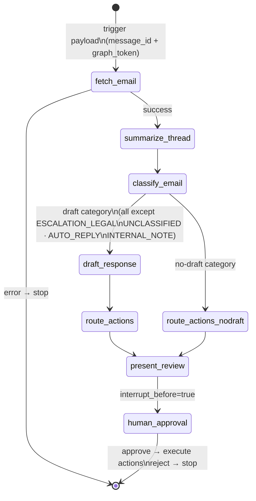
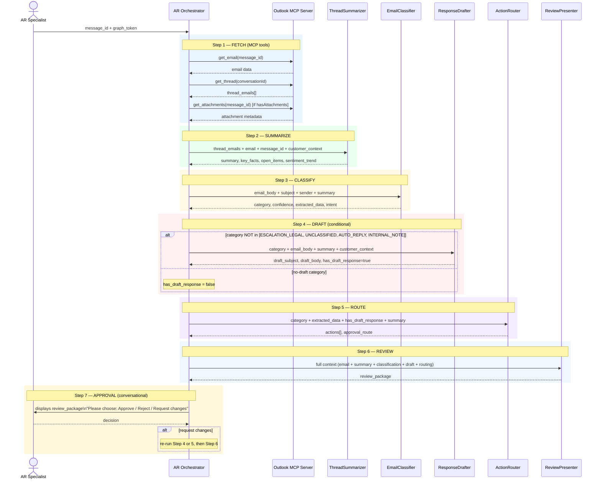

# AR Email Management — Pipeline Architecture

## Overview

The AR Email Management pipeline processes inbound Accounts Receivable emails through a sequence of specialized AI agents. Each email is fetched, summarized, classified, optionally drafted, routed to the correct SAP/Outlook action, and presented to an AR specialist for approval before any system action is taken.

**6 assistants. 2 skills. 1 MCP server. 2 integration patterns.**

---

## Trigger Paths

| Path | Trigger | Email Input | MCP Needed |
|------|---------|-------------|------------|
| **Path B — SAP UI** | SAP Fiori calls CodeMie API | `message_id` + `X-Graph-Token` | Yes — Orchestrator fetches via MCP |
| **Path C — Alevate UI** | User selects email in browser | `message_id` + `X-Graph-Token` (MSAL.js PKCE) | Yes — Orchestrator fetches via MCP |
| **Path A — Webhook** | Email Ingestion Service (external) | Full email content in payload | No — content arrives pre-fetched |

---

## Integration Patterns

Two patterns are supported. The 5 specialist assistants are **shared** between both.

| | Pattern A — Workflow | Pattern B — Sub-assistant Orchestration |
|--|---------------------|----------------------------------------|
| Driven by | CodeMie workflow engine (YAML) | AR Orchestrator LLM |
| Context passing | Automatic via context store | Manual — orchestrator passes to each call |
| Human approval | `interrupt_before` checkpoint (hard) | Conversational in chat (soft) |
| Conditional branching | Declarative YAML condition | LLM decision |
| Best for | Production, automated triggers | Interactive sessions, prototyping |

---

## Pattern A — Workflow State Flow

**State → Assistant mapping:**

| Workflow State | Assistant | Skip condition |
|----------------|-----------|---------------|
| `fetch-email` | Orchestrator | Never |
| `summarize-thread` | ThreadSummarizer | Never |
| `classify-email` | EmailClassifier | Never |
| `draft-response` | ResponseDrafter | Skipped for 4 no-draft categories |
| `route-actions` / `route-actions-nodraft` | ActionRouter | Never |
| `present-review` | ReviewPresenter | Never |
| `human-approval` | — (interrupt) | Never |

---

## Pattern B — Sub-assistant Orchestration Flow

The AR Orchestrator calls each specialist as a sub-assistant tool in sequence. Context is passed explicitly at every step.

---

## Agent Catalog

### Orchestrator (Pattern A only)

| Field | Value |
|-------|-------|
| **Responsibility** | Entry point. Fetches email content from Outlook via MCP tools and initialises the context store. |
| **MCP Server** | Outlook MCP — configured in assistant UI (External tools) |
| **Skills** | `ar-mcp-tools` |
| **Temperature** | 0 |

**Input:**

| Key | Source |
|-----|--------|
| `message_id` / `message_ids` | Trigger payload |
| `graph_token` | Trigger payload (Path B / C) |
| `customer_context` | Trigger payload (optional) |

**Output:**

| Key | Description |
|-----|-------------|
| `message_id` | Primary message ID |
| `email` | `{ from, sender_name, subject, body, received_at }` |
| `email_body` | Duplicate of `email.body` for convenience |
| `thread_id` | `conversationId` from Graph |
| `thread_emails` | Array of all emails in thread, oldest first |
| `has_attachments` | Boolean |
| `attachment_metadata` | Array of `{ name, contentType, size }` |

---

### AR Orchestrator (Pattern B only)

| Field | Value |
|-------|-------|
| **Responsibility** | True multi-agent orchestrator. Fetches email via MCP then coordinates all 5 sub-assistants in sequence, passing context manually at each step. Human approval is conversational. |
| **MCP Server** | Outlook MCP — configured in assistant UI (External tools) |
| **Sub-assistants** | ThreadSummarizer, EmailClassifier, ResponseDrafter, ActionRouter, ReviewPresenter |
| **Skills** | `ar-mcp-tools` |
| **Temperature** | 0 |

---

### ThreadSummarizer

| Field | Value |
|-------|-------|
| **Responsibility** | Reads the full email thread and produces a structured summary — key facts, open items, sentiment trend. Acts as the memory layer for all downstream agents. Always runs. |
| **Skills** | None |
| **Temperature** | 0 |

**Input:**

| Key | Source |
|-----|--------|
| `thread_emails` | Orchestrator output |
| `message_id` | Orchestrator output |
| `existing_summary` | Context store (prior run) — null on first processing |
| `customer_context` | Trigger payload |

**Output:**

| Key | Description |
|-----|-------------|
| `summary` | Narrative thread summary (≤ 500 words) |
| `key_facts` | Array of `{ fact, source_email_id, date }` |
| `open_items` | Array of `{ item, status: PENDING\|IN_PROGRESS\|RESOLVED }` |
| `sentiment_trend` | `IMPROVING \| STABLE \| DETERIORATING` |
| `thread_age_days` | Days from oldest to newest email |
| `total_emails` | Count of emails in thread |

---

### EmailClassifier

| Field | Value |
|-------|-------|
| **Responsibility** | Classifies the email into one of 15 AR categories with confidence score, sub-category, extracted entities, and routing flag. Its `category` determines whether ResponseDrafter runs. |
| **Skills** | `ar-taxonomy` |
| **Temperature** | 0 |

**Input:**

| Key | Source |
|-----|--------|
| `email_body` | Orchestrator output |
| `subject` | Orchestrator output |
| `from` / `sender_name` | Orchestrator output |
| `summary` | ThreadSummarizer output |
| `thread_id` | Orchestrator output |
| `previous_classifications` | Context store (prior runs) — empty on first run |

**Output:**

| Key | Description |
|-----|-------------|
| `category` | Primary category (1 of 15) |
| `sub_category` | Optional refinement (e.g. `PRICING`, `SHORT_PAYMENT`) |
| `categories` | All applicable labels — primary first, max 3 |
| `confidence` | 0.0 – 1.0 |
| `priority` | `HIGH \| MEDIUM \| LOW` |
| `summary` | 1-2 sentence intent summary |
| `language` | ISO 639-1 code |
| `intent` | `{ customer_statement, required_action, urgency }` |
| `reasoning` | 2-4 sentence classification rationale |
| `extracted_data` | `{ invoice_numbers, promised_date, due_date, disputed_amount, currency, payment_reference }` |
| `suggested_actions` | Array of `{ action, description, priority }` |
| `escalation` | `{ required: bool, reason }` |

**Routing gate:** `category ∈ {ESCALATION_LEGAL, UNCLASSIFIED, AUTO_REPLY, INTERNAL_NOTE}` → skip ResponseDrafter

---

### ResponseDrafter

| Field | Value |
|-------|-------|
| **Responsibility** | Drafts a professional customer-facing AR reply. Skipped for 4 no-draft categories — ActionRouter receives `has_draft_response: false`. |
| **Skills** | None |
| **Temperature** | 0.3 ← only non-zero agent |

**Input:**

| Key | Source |
|-----|--------|
| `category`, `sub_category`, `confidence`, `intent` | EmailClassifier output |
| `email_body` | Orchestrator output |
| `summary` | ThreadSummarizer output |
| `customer_context` | Trigger payload |
| `invoice_data` | Trigger payload (optional) |
| `sap_template` | Trigger payload (optional) |

**Output:**

| Key | Description |
|-----|-------------|
| `draft_subject` | Reply subject line |
| `draft_body` | Reply body (≤ 300 words) |
| `tone` | `FORMAL \| EMPATHETIC \| FIRM` |
| `template_used` | SAP template ID or null |
| `has_draft_response` | Always `true` when this assistant runs |
| `language` | ISO 639-1 code |
| `warnings` | Array of drafting warnings |

**No-draft categories (skipped):** `ESCALATION_LEGAL`, `UNCLASSIFIED`, `AUTO_REPLY`, `INTERNAL_NOTE`

---

### ActionRouter

| Field | Value |
|-------|-------|
| **Responsibility** | Maps classification to an ordered list of SAP / Outlook / Alevate actions and assigns an approval route. Applies 7 override rules. Always runs — called from both draft and no-draft paths. |
| **Skills** | `ar-taxonomy` |
| **Temperature** | 0 |

**Input:**

| Key | Source |
|-----|--------|
| `category`, `sub_category`, `confidence`, `priority` | EmailClassifier output |
| `extracted_data` | EmailClassifier output |
| `has_draft_response` | ResponseDrafter output (`true`) or workflow flag (`false`) |
| `draft_subject` | ResponseDrafter output (or null) |
| `summary` | ThreadSummarizer output |
| `customer_context` | Trigger payload |

**Output:**

| Key | Description |
|-----|-------------|
| `actions` | Array of `{ action_type, target_system, parameters, priority, invoice_number }` |
| `approval_route` | `STANDARD \| PRIORITY \| SUPERVISOR \| LEGAL` |
| `reasoning` | Explanation of action selection and any override rules applied |

---

### ReviewPresenter

| Field | Value |
|-------|-------|
| **Responsibility** | Assembles all pipeline outputs into a structured review package for the AR specialist. Its output is what the approver sees in the approval UI. |
| **Skills** | `ar-taxonomy` |
| **Temperature** | 0 |

**Input:**

| Key | Source |
|-----|--------|
| `email` | Orchestrator output |
| `has_attachments`, `attachment_metadata` | Orchestrator output |
| `summary`, `key_facts`, `open_items`, `sentiment_trend` | ThreadSummarizer output |
| `category`, `sub_category`, `confidence`, `priority`, `intent`, `reasoning`, `extracted_data`, `escalation` | EmailClassifier output |
| `draft_subject`, `draft_body`, `tone`, `has_draft_response` | ResponseDrafter output (or null) |
| `actions[]`, `approval_route` | ActionRouter output |
| `customer_context` | Trigger payload |

**Output:**

| Key | Description |
|-----|-------------|
| `review_package.header` | `{ email_id, priority_badge, category_label, confidence_indicator, received_at, approval_route }` |
| `review_package.context_section` | `{ customer_email_summary, thread_context, ai_reasoning }` |
| `review_package.action_section` | `{ proposed_response, proposed_system_actions[] }` |
| `review_package.decision_buttons` | `["APPROVE", "EDIT_AND_APPROVE", "REJECT", "ESCALATE"]` (varies by category) |
| `review_package.warnings` | Array of pipeline warnings (low confidence, attachments, large amounts, etc.) |

---

## Skills

| Skill | Attached to | Purpose |
|-------|-------------|---------|
| `ar-mcp-tools` | Orchestrator (both patterns) | Tool reference: fetch sequence, parameters, response schemas, error codes, PII levels |
| `ar-taxonomy` | EmailClassifier, ActionRouter, ReviewPresenter | 15-category taxonomy, sub-categories, approval routes, override rules, escalation conditions |

---

## MCP Server

**Attached to:** Orchestrator assistant (UI: Available tools → External tools → Manual Setup)

| Tool | Used in | Purpose |
|------|---------|---------|
| `get_email` | Fetch sequence Step 1 | Fetch email by Graph message ID |
| `get_thread` | Fetch sequence Step 2 | Fetch full thread history |
| `get_attachments` | Fetch sequence Step 3 (conditional) | List attachment metadata |
| `search_emails` | Optional / ad-hoc | KQL search across mailbox |

---

## Context Store Keys (Pattern A)

In workflow mode, all agent JSON outputs automatically populate the shared context store. This table shows the full set of keys available at each pipeline stage.

| Key | Set by | Consumed by |
|-----|--------|-------------|
| `message_id`, `email`, `email_body`, `thread_id`, `thread_emails`, `has_attachments`, `attachment_metadata` | Orchestrator | ThreadSummarizer, EmailClassifier, ResponseDrafter, ReviewPresenter |
| `summary`, `key_facts`, `open_items`, `sentiment_trend`, `thread_age_days`, `total_emails` | ThreadSummarizer | EmailClassifier, ResponseDrafter, ActionRouter, ReviewPresenter |
| `category`, `sub_category`, `categories`, `confidence`, `priority`, `intent`, `extracted_data`, `escalation` | EmailClassifier | ResponseDrafter, ActionRouter, ReviewPresenter |
| `draft_subject`, `draft_body`, `tone`, `has_draft_response` | ResponseDrafter | ActionRouter, ReviewPresenter |
| `actions`, `approval_route` | ActionRouter | ReviewPresenter |
| `review_package` | ReviewPresenter | Human approval UI |
| `graph_token`, `customer_context`, `invoice_data`, `sap_template` | Trigger payload | All agents (as needed) |
